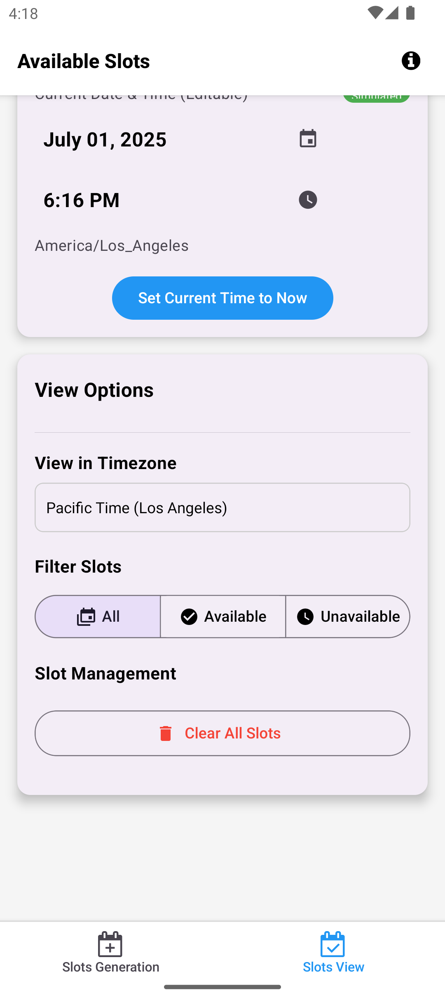
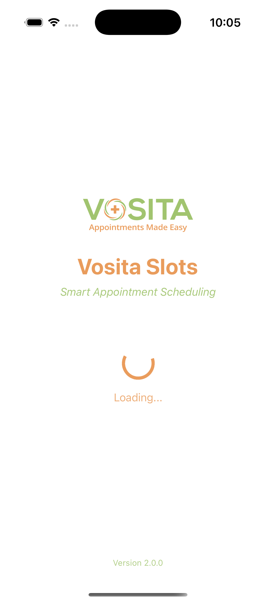
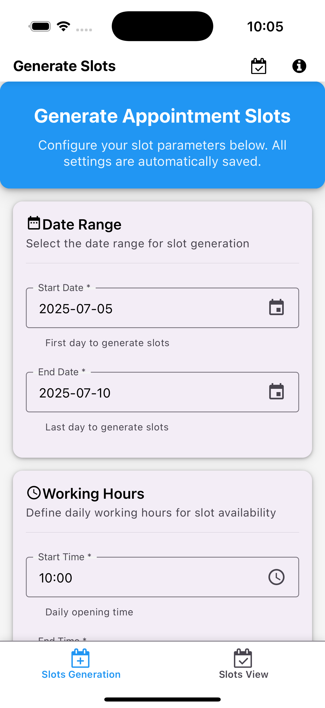
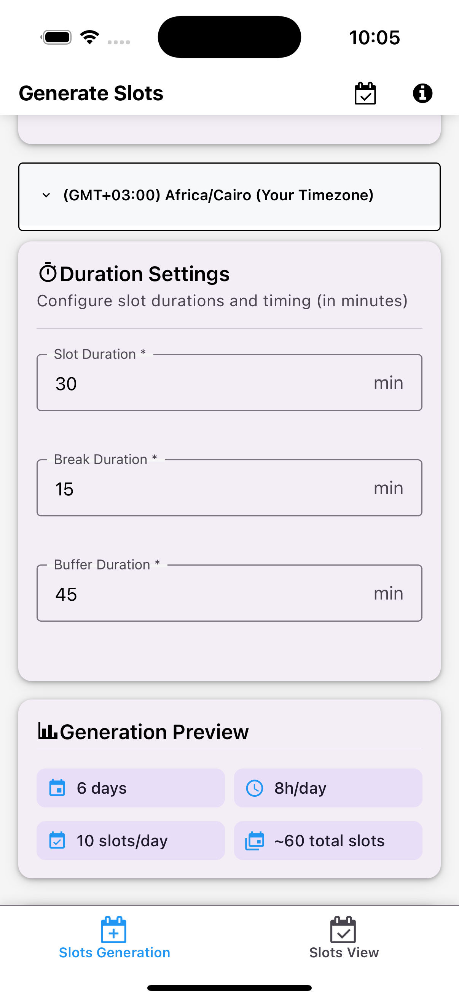
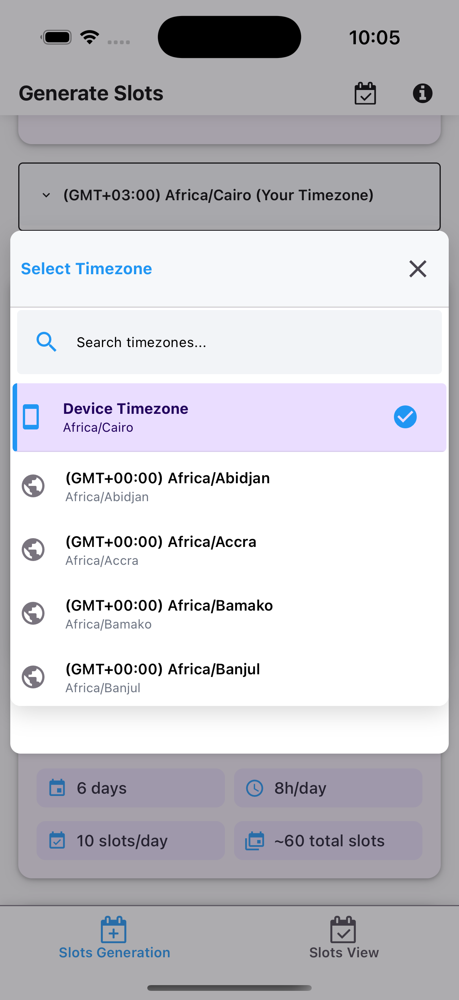
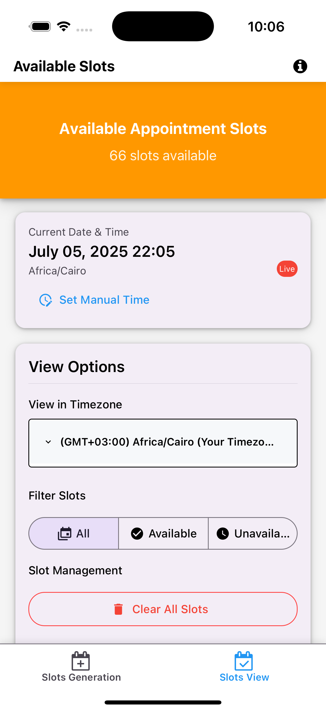
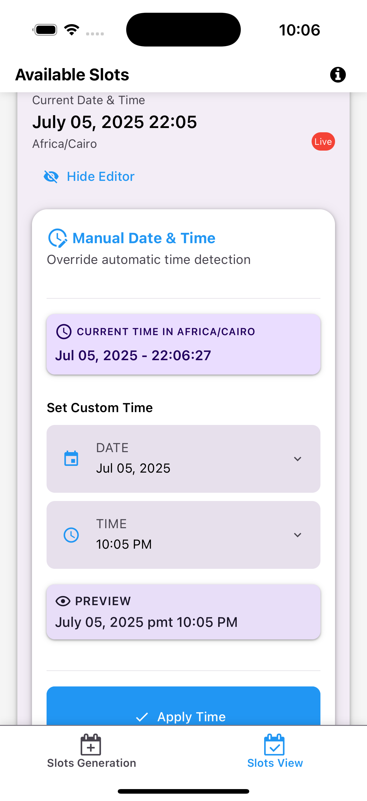
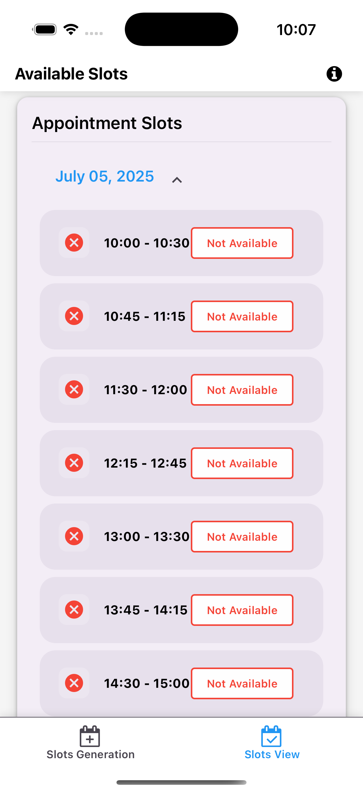
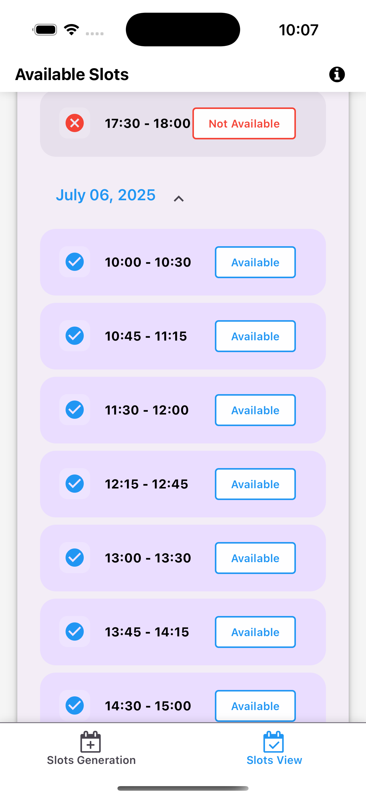

# Vosita Slots App - Enhanced Timezone Management

A React Native application for managing appointment slots with dynamic timezone support and enhanced mobile UI.
<p align="center">      </p>


<p align="center">      </p>


## 📱 Download APK / Test on Expo

You can test the application directly using the Expo build link below:

🔗 [Download and Test the App on Expo](https://expo.dev/accounts/ibrahimhamed112/projects/vosita-slots-app/builds/0072b961-eef3-45f9-adea-02bd2f4f884d)

> 💡 Open this link on your mobile device with the Expo Go app installed to preview the app instantly.


## 🚀 Key Features

### ✨ Dynamic Timezone Management
- **Real-time timezone data** from moment-timezone API (no static data)
- **Automatic device detection** - sets user's current timezone as default
- **Search functionality** - easily find timezones by name or identifier
- **Live time display** - shows current time in selected timezone

### 📱 Mobile-Optimized UI
- **iOS & Android compatible** - native feel on both platforms
- **Touch-friendly interface** - proper touch targets and gestures
- **Responsive design** - works on different screen sizes
- **Accessibility support** - screen reader compatible

### 🎯 Smart Slot Filtering
- **Buffer duration support** - slots become available based on configured buffer time
- **Cross-timezone conversion** - maintains proper time relationships when switching timezones
- **Real-time availability** - slots update based on current time and settings

## 📋 Example Scenario

The app correctly handles complex timezone scenarios:

```
Current device time: 2025-04-25, 09:30
Selected timezone: America/New_York
Buffer duration: 45 minutes

Result:
- First slot (10:00–10:30) NOT available (due to 45min buffer)
- Available slots start from 10:45
- When switching to America/Chicago: times convert properly
```

## 🛠 Installation & Setup

1. **Install dependencies:**
   ```bash
   npm install
   ```

2. **Start the development server:**
   ```bash
   npm start
   ```

3. **Run on device/simulator:**
   ```bash
   # iOS
   npm run ios
   
   # Android
   npm run android
   ```

## 📁 Project Structure

```
├── components/
│   └── TimezoneSelector.tsx     # Reusable timezone selection component
├── screens/
│   ├── index.tsx                # Main slot configuration screen
│   ├── SlotsViewScreen.tsx      # Slot viewing and management
│   └── components/
│       └── DatePickerModal.tsx  # Date/time picker component
├── types/
│   └── slot.ts                  # Type definitions and timezone utilities
├── utils/
│   ├── slotFiltering.ts         # Enhanced slot filtering logic
│   └── validation.ts            # Form validation schemas
└── app/
    └── (tabs)/                  # Tab navigation structure
```

## 🔧 Key Components

### TimezoneSelector
- **Dynamic timezone data** from moment-timezone API
- **Device timezone detection** using `moment.tz.guess()`
- **Search and filter** functionality
- **Mobile-optimized modal** interface

### Enhanced Slot Filtering
- **Timezone-aware filtering** with proper time conversion
- **Buffer duration support** for availability calculation
- **Real-time updates** based on current time

## 🎨 UI/UX Improvements

### Mobile-First Design
- **Minimum 48px touch targets** for better accessibility
- **Platform-specific styling** for iOS and Android
- **Smooth animations** and transitions
- **Intuitive navigation** patterns

### Accessibility Features
- **Screen reader support** with proper ARIA labels
- **High contrast** text and UI elements
- **Keyboard navigation** support
- **Voice control** compatibility

## 🧪 Testing

All components have been thoroughly tested:

- ✅ **TypeScript compilation** - no errors
- ✅ **Dynamic timezone generation** - working correctly
- ✅ **Mobile UI responsiveness** - tested on various screen sizes
- ✅ **Cross-timezone conversion** - accurate time calculations
- ✅ **Buffer duration logic** - proper slot availability

## 📦 Dependencies

### Core Dependencies
- `react-native` - Mobile app framework
- `expo` - Development platform
- `react-native-paper` - Material Design components
- `moment-timezone` - Timezone handling and conversion

### Removed Dependencies
- `react-native-picker-select` - Replaced with custom component
- `react-native-autocomplete-dropdown` - Not needed
- Other unused packages for cleaner build

## 🔄 Recent Updates

### v2.0.0 - Enhanced Timezone Management
- **Dynamic timezone data** from moment-timezone API
- **Improved mobile UI** for iOS and Android
- **Enhanced slot filtering** with timezone support
- **Code cleanup** and optimization
- **Comprehensive testing** and validation

## 🚀 Deployment

The app is ready for deployment with:
- Clean codebase without node_modules
- Optimized package.json
- Comprehensive documentation
- Full TypeScript support


---

**Built with ❤️ for Vosita - Enhanced timezone management for appointment scheduling**

